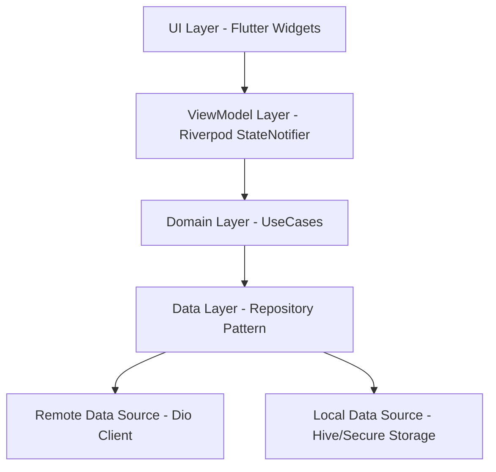
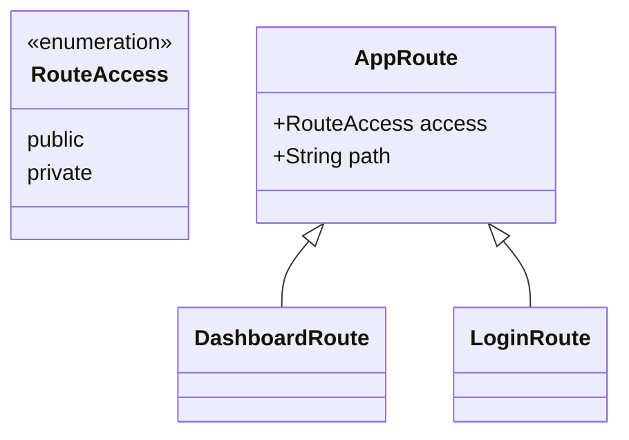
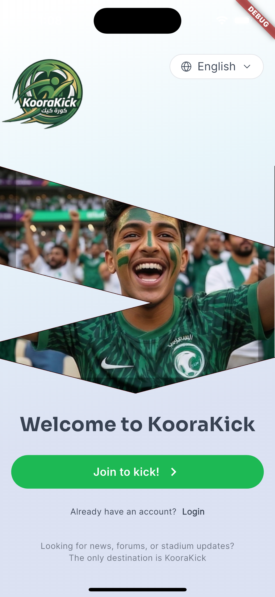
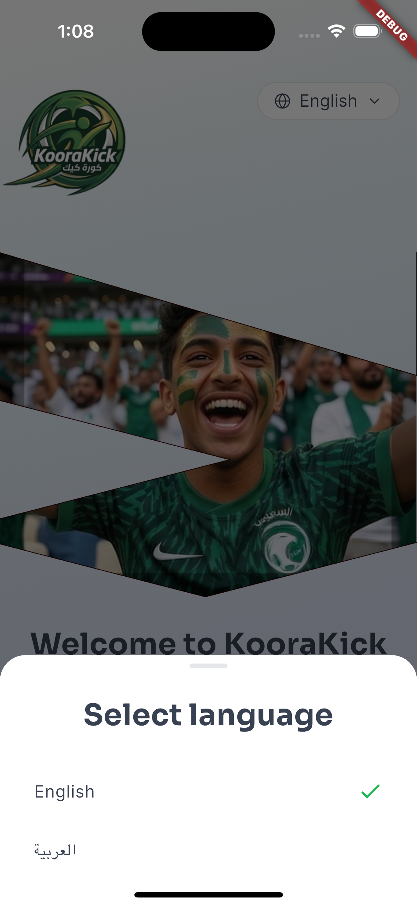
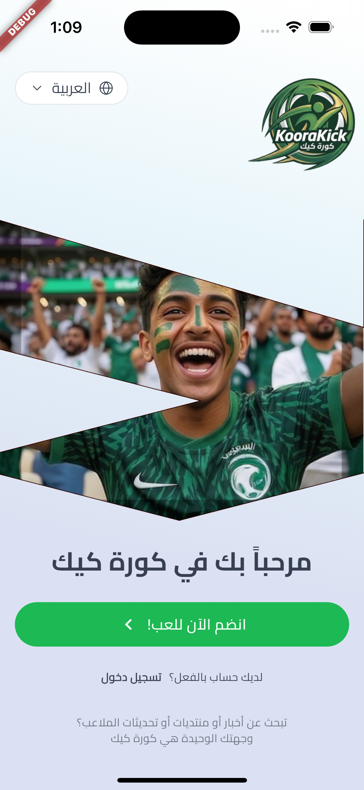
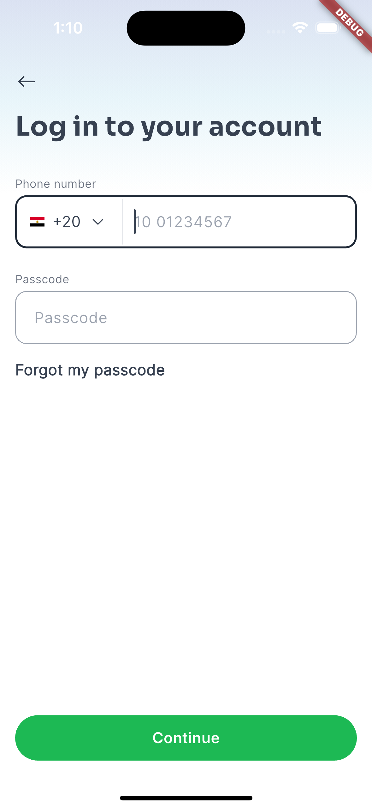
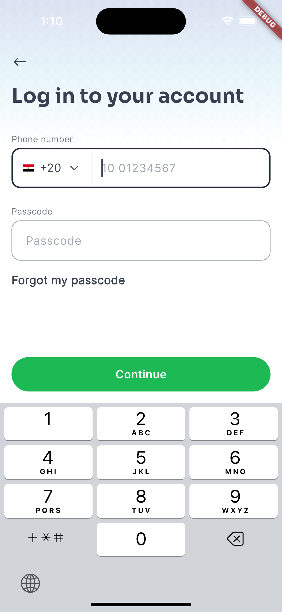
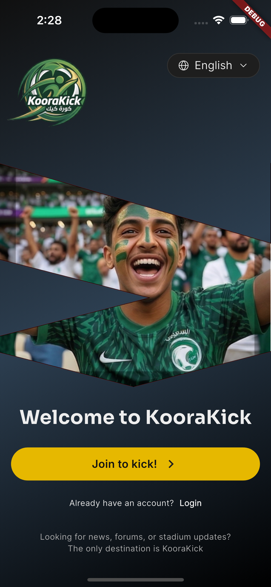

# ⚽ KooraKick - The Ultimate Football Social Platform

KooraKick is a premium, high-performance Flutter application designed for the next generation of football fans. Built with a **Scalable Modular Architecture**, it features a sophisticated MVI-based state management system, a highly custom design language, and enterprise-grade networking.

---

## 🏛 Architecture Overview

We follow a strictly decoupled architecture that ensures maximum testability and scalability as the platform grows.



### 💎 Key Architectural Pillars

1.  **MVI Pattern (Model-View-Intent)**:
    -   **Intent**: UI events captured as intents.
    -   **Model**: Represents the immutable state of the screen.
    -   **View**: A stateless representation of the UI.
2.  **Sealed Unions (Freezed)**:
    -   We use `sealed classes` for State and Events to ensure **100% type safety** and exhaustive switch-case handling.
3.  **Clean Architecture Core**:
    -   Separation of concerns between Data, Domain, and Presentation layers.

---

## 🎨 Premium Design Library

KooraKick features a custom-built, semantic UI library that ensures design consistency across all screens. These components are fully theme-aware and support both Light and Dark modes out of the box.

### 🔘 Buttons (`AppButton`)
A versatile button system with multiple variants.
-   **Primary**: High-emphasis green actions.
-   **Secondary**: Subtle surface-based actions.
-   **Text/Icon**: Low-emphasis interactive elements.
-   **Loading State**: Integrated `CircularProgressIndicator` with smooth transitions.

### ⌨️ Inputs (`AppTextField`)
Enterprise-grade input fields with:
-   **Theme-aware Borders**: Dynamic colors for focus, error, and idle states.
-   **Prefix/Suffix Support**: Integrated icon and label management.
-   **Native Feeling**: Optimized for iOS/Android feedback.

### 🖼 Images (`AppImage`)
A smart image wrapper that handles:
-   **Assets, Network, and File** types transparently.
-   **Color Filtering**: Automatic SVG coloring based on current theme context.
-   **Placeholders**: Built-in loading and error state management.

---

## 🏗️ Code Design Patterns

### 🔗 Fluent Builder Pattern — Readable DSL

Instead of passing 10 constructor arguments, we use a chained builder API across the entire UI layer. This keeps call sites clean, readable, and easy to change.

**`AppRichTextBuilder`** — Composing complex inline text with links in one readable chain:
```dart
Widget termAndPrivacy(BuildContext context) => AppRichTextBuilder(context)
    .add("auth_termAndPrivacy_agreeText".localized())
    .space()
    .link("auth_termAndPrivacy_termTitle".localized(), onTap: () {})
    .space()
    .add("global_and".localized())
    .space()
    .link("auth_termAndPrivacy_privacyTitle".localized(), onTap: () {})
    .build(
      textAlign: TextAlign.center,
      baseStyle: AppTextStyle.textBody(13, textColor: AppColors.textSubtle),
    );
```

**`AppImage`** — Smart image rendering with fluent styling:
```dart
// Simple asset icon with color
AppImage.asset(AppAssets.icStar)
    .setDimension(width: 24, height: 24)
    .setStyle(AppImageStyle(color: Colors.amber))
    .build()

// Circular network avatar with loading placeholder
AppImage.network(user.profileUrl)
    .setDimension(width: 50, height: 50)
    .setStyle(const AppImageStyle.circular())
    .setPlaceholder(widget: const CircularProgressIndicator.adaptive())
    .build()
```

**`KooraKickPageBuilder`** — Full-page layout DSL:
```dart
return KooraKickPageBuilder.noAppBar()
    .centered()
    .withBottomContent(PrimaryButton())
    .content(FormWidgets())
    .build(context);
```
> Every builder follows the same principle: **configure → chain → build**. No widget constructors with 12 named args scattered across the codebase.

---

### 🔒 Sealed State Pattern — Type-Safe UI States

We use **Freezed sealed classes** to represent every possible screen state. This eliminates `isLoading` booleans, nullable error fields, and undefined in-between states.

**State Definition:**
```dart
@freezed
sealed class CreateAccountStatus with _$CreateAccountStatus {
  const factory CreateAccountStatus.initial()                        = _Initial;
  const factory CreateAccountStatus.loading()                        = _Loading;
  const factory CreateAccountStatus.error(AppError error)            = _Error;
  const factory CreateAccountStatus.success(UserSessionStatus status) = _Success;
}
```

**ViewModel emits new state (Intent → Model):**
```dart
// Loading starts
state = state.copyWith(createAccountStatus: const CreateAccountStatus.loading());

// On success
state = state.copyWith(
  createAccountStatus: CreateAccountStatus.success(userSessionStatus),
);

// On failure
state = state.copyWith(
  createAccountStatus: CreateAccountStatus.error(AppError.api(message: msg)),
);
```

**UI reacts exhaustively (Model → View):**
```dart
ref.listen(createAccountViewModelProvider, (_, state) {
  state.createAccountStatus.when(
    initial:  ()        => {},
    loading:  ()        => showLoader(),
    error:    (err)     => showSnackbar(err.message),
    success:  (status)  => navigateToDashboard(),
  );
});
```
> Because `when` is **exhaustive** (compiler-enforced), it is impossible to forget handling any state — no silent null crashes, ever.

---

## 🚀 Pro-Level Features

### 1. KooraKickPageBuilder (The UI Engine)
A central, highly flexible DSL-like builder that manages all common page layouts, backgrounds, scrolling behavior, and navigation bar transitions in one place.

```dart
// Example Usage
return KooraKickPageBuilder.noAppBar()
    .centered()
    .withBottomContent(SubmitButton())
    .content(
      "Main Content Here".text().bodyLarge(),
    )
    .build(context);
```

### 2. Scalable Network Client (Dio + Retry)
Our networking layer is built on **Dio** with a custom **Smart Retry Mechanism**.
-   **Transparent Retries**: Automatically handles transient network failures.
-   **Security**: Integrated JWT Interceptors for automatic token management.
-   **Logging**: Sophisticated logging for debug builds.

### 3. Integrated Theme Manager
A specialized design system that supports **Native-feeling UI** with custom HSL-based color palettes.
-   Supports **Solid**, **Gradient**, and **Image-based** backgrounds natively through the `AppBackgroundProperty`.
-   Dynamic typography management through `ContextExtensions`.

### 4. Enterprise Localization
-   **Multi-language Support**: Deeply integrated Arabic (RTL) and English (LTR) support.
-   **Translation Management**: Centralized JSON-based localization with automatic string extension methods (`"key".localized()`).

---

## 🛣 Advanced Routing (GoRouter)

We use `go_router` with a strict `RouteAccess` management system to handle security and navigation state.



-   **Public Routes**: Accessible by all users (Landing, Login, Register).
-   **Private Routes**: Protected by a global redirect guard that checks authentication state before permitting access.
-   **Nested Navigation**: Uses `StatefulShellRoute` for smooth tab-bar transitions without losing screen state.

---

## 📱 App Showcase

| Landing (EN) | Language Select | Landing (AR) |
| :--- | :--- | :--- |
|  |  |  |

| Login (EN) | Login (Keypad) | Dark Mode Support |
| :--- | :--- | :--- |
|  |  |  |

---

## 🌟 Upcoming Product Roadmap

We are continuously evolving KooraKick to become the definitive destination for football fans.

| Feature & Icon | Purpose & Impact |
| :--- | :--- |
| **🏠 Home (Mixed Feed)** <br> `Icons.home_rounded` | A dynamic AI-driven feed combining world-class soccer news APIs with top-rated stadium construction updates from the community. |
| **👥 Channels (Hub)** <br> `Icons.groups_rounded` | Specialized fan territories for giant Saudi clubs (Al-Hilal, Al-Nassr) and city-based community forums (e.g., Khobar Updates). |
| **📍 KooraMap (USP)** <br> `Icons.stadium_rounded` | Our Unique Selling Point: A deep Google Maps integration tracking real-time stadium builds across Saudi cities with high-res community imagery. |
| **⚽ Live (Scores)** <br> `Icons.sports_soccer_rounded` | Real-time match analytics and standings powered by Firebase Cloud Functions for instantaneous score updates. |
| **👤 Profile (User Space)** <br> `Icons.person_pin_rounded` | Personal gallery for user posts, earned badges (Gamification), and granular club preference settings. |

---

## 🛠 Tech Stack

-   **State Management**: Riverpod (Providers, StateNotifiers)
-   **Code Generation**: Freezed, JsonSerializable, BuildRunner
-   **Networking**: Dio + Retry Interceptor
-   **Persistence**: Hive (NoSQL), Flutter Secure Storage
-   **Routing**: GoRouter (Typed Routes)
-   **UI Components**: Super Cupertino (For iOS-native feel)

---

## 📖 Dev Commands

| Command      | Description                         |
|--------------|-------------------------------------|
| `make brb`   | Run `build_runner build`            |
| `make brw`   | Start `build_runner` in watch mode  |
| `make brclean` | Clean generated files             |

---
Designed with ❤️ for the global football community.
